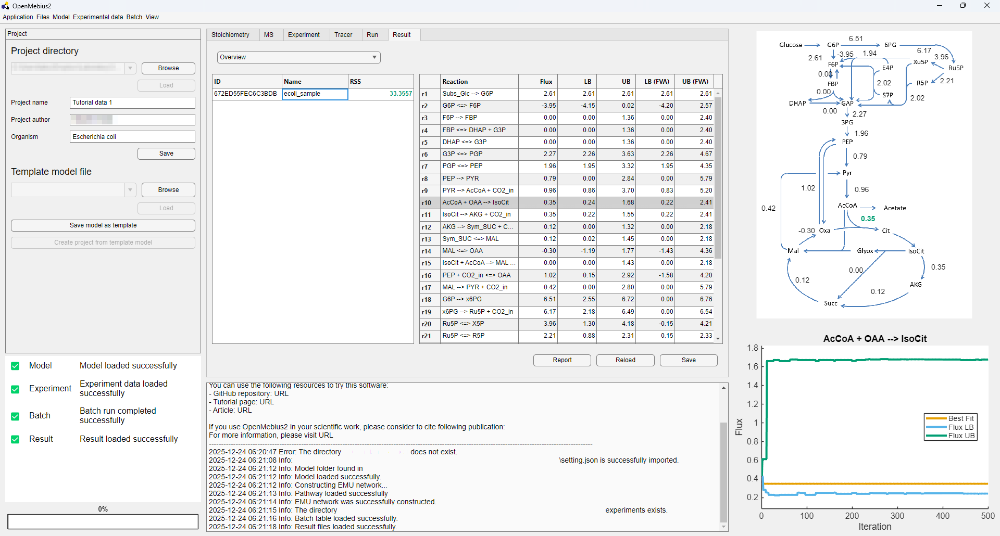
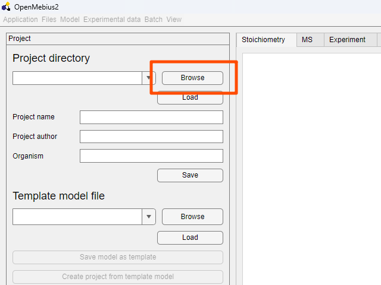
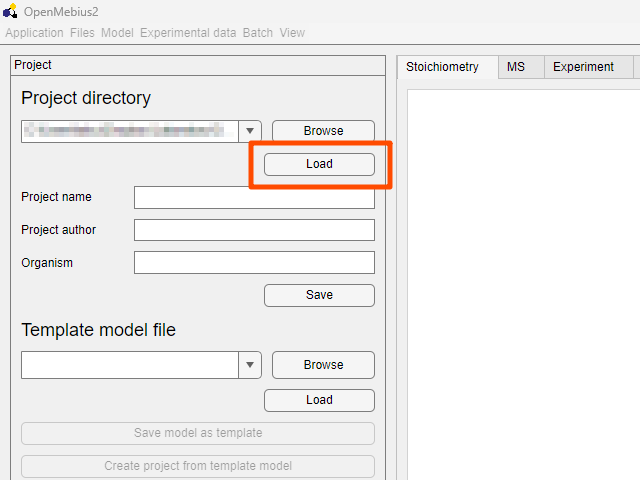
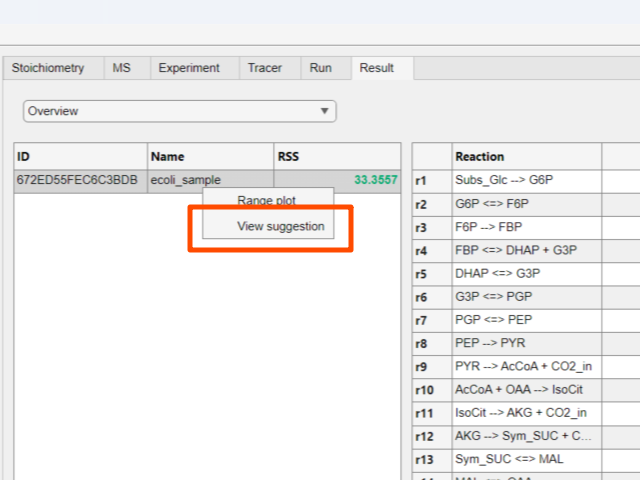
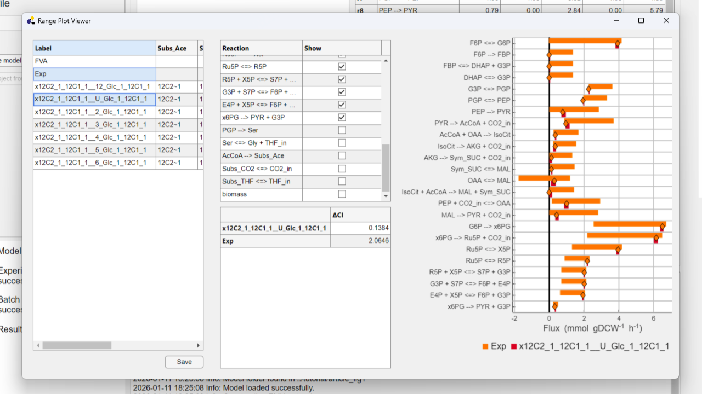

# OpenMebius2

English | [日本語](README_ja.md)


[](https://matlab.mathworks.com/open/github/v1?repo=metabolic-engineering/OpenMebius2)

13C-metabolic flux analysis (13C-MFA) is a technique that determine an intracellular metabolic flux distribution by using tracer information.
OpenMebius was developed in 2014 as a integrated platform that can perform 13C-MFA by Mr. Kajihata when he was a PhD student and it was publishd to [BioMed Research International][1]
This software was able to calculate instationary metabolic flux analysis via command line.
Here, we have enhanced this software to enable analysis, visualization, and data processing related to to 13C-MFA though a graphical user interface (GUI).



## Installation
To get started with OpenMebius2, please download the latest release from the [Releases](https://github.com/metabolic-engineering/OpenMebius2/releases) page.

### Windows Installation
1. Download the installer from the releases page.
2. Run ```openmebius2-vx.x.x-windows-x86-64.exe``` and follow the installation instructions (administrator privileges may be required).
3. After installation, launch OpenMebius2 from the Start Menu or desktop shortcut.

### MacOS Installation
1. Download the DMG file from the releases page.
2. Open the ```openmebius2-vx.x.x-macos-x86-64.dmg``` file and drag the OpenMebius2 application to your Applications folder.
3. Launch OpenMebius2 from the Applications folder.

### Linux Installation
1. Download the installer from the releases page.
2. Make the installer executable by running the following command in the terminal:
   ```bash
   chmod +x openmebius2-v2.0.0-linux-x86_64.install
   ```
3. Run the installer with the following command:
   ```bash
   bash ./openmebius2-v2.0.0-linux-x86_64.install
   ```

## Quick Start Guide
For detailed instructions on how to use OpenMebius2, please refer to the [Online documentation](https://metabolic-engineering.github.io/OpenMebius2/) available in the documentation section.
Here, you will find step-by-step guides on how to reproduce the figures presented in the published paper.

1. Open OpenMebius2.
2. Click `Browse` button and select the sample project directory `article_fig1` located in the `tutorial` directory.

<p align="center">
  
</p>

3. Click `Load` button to load the project.

<p align="center">
  
</p>

1. In this project, the required information such as specific growth rate, extracellular fluxes, and mass distribution vectors (MDVs) are already set. If you only want to see the results, click the `Result` tab to view the flux distribution results.

2. To visualize the tracer suggestion with low cost experiments, right-click on the result item and select `View Suggestion`.

<p align="center">
  
</p>

6. Selected items will be shown in the plot area.

<p align="center">
  
</p>

7. If you want to perform whole analysis from the beginning, go to the `Run` tab and click the `Auto` button to make a batch row.
8. Select the created row and click the `config` button to open the configuration window.

## How to cite
If you use OpenMebius2 in your research, please cite the following paper:

1. Kajihata, S., Furusawa, C., Matsuda, F. & Shimizu, H. OpenMebius: An Open Source Software for Isotopically Nonstationary 13 C-Based Metabolic Flux Analysis. BioMed Research International 2014, 1–10 (2014).
2. Imada, T., Shimizu, H., Toya, Y., OpenMebius2: GUI-based software for 13C-metabolic flux analysis with tracer labeling pattern suggestions for accurate flux predictions. bioRxiv 2026, doi: 10.64898/2026.03.20.698926

[1]: https://onlinelibrary.wiley.com/doi/10.1155/2014/627014