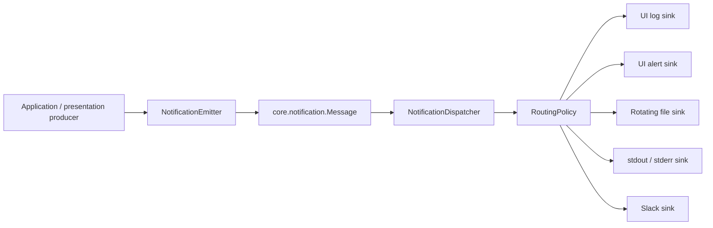

# Dependency direction

OpenMebius2 uses an inward dependency direction:

```text
App Designer views
        |
        v
Presentation (Presenter, Action, Context, ViewModel)
        |
        v
Application (Controller, UseCase, Session, Workflow)
        |
        +--------------------+
        v                    v
Domain values             MFA / EMU
        ^                    ^
        |                    |
Infrastructure repositories and adapters
```

The Composition Root in `openmebius.bootstrap.MainAppCompositionRoot` creates
the concrete repositories, services, controllers, and presenters used by the
main App. Infrastructure is selected at this outer boundary and supplied to
application services.

# Enforced rules

- `+application`, `+domain`, and `+mfa` must not reference
  `openmebius.presentation`, `matlab.ui.*`, `uitable`, `uiaxes`, or dialogs.
- Domain and MFA code must not read or write project directories directly.
- Repositories own JSON, Excel, HDF5, hashing, atomic replacement, and migration.
- App callbacks collect input, invoke an application controller, and render a
  view model. They do not mutate model, experiment, batch, or result internals.
- Child Apps receive a typed Context, emit an Action or event result, and are
  attached and closed by `ChildAppHost`.
- Application notifications use `openmebius.core.notification.Message` and a
  function-handle port. Presentation may map that value to App Designer events.
- Expected command failures return an `OperationOutcome` subtype. Corrupt files
  and programming errors use identified `MException` values.

`LayerDependencyBoundaryTest`, `MainAppDomainBoundaryTest`, and the child-App
boundary tests enforce these rules in the fast test profile.

# Unified notification delivery

Every user-facing message and operational diagnostic is represented by
`openmebius.core.notification.Message`. Producers do not select UI, file,
console, or Slack destinations. Application services create the value through
`NotificationEmitter` and publish it once through an injected function-handle
port.



The message carries a stable event ID, optional correlation ID, event code,
severity, user text, diagnostic text, source, structured context, audience,
attention requirement, and kind. `NotificationDispatcher` suppresses repeated
event IDs and isolates sink failures so a logging or remote-delivery failure
cannot fail the application operation.

| Sink | Default desktop policy |
|---|---|
| File | `debug` and above; explicit append with size-based rotation |
| Console | `warning` and above; normal output uses stdout, failures use stderr |
| UI log | `info` and above, excluding progress and developer-only messages |
| UI alert | User messages requiring action, plus fatal messages |
| Slack | Allow-listed terminal batch event codes only |

UI sinks are registered after the App Designer controls exist and removed when
the main App closes. `MainAppCompositionRoot` owns the long-lived dispatcher
and non-UI sinks. Test mode disables console delivery. The file sink replaces
MATLAB `diary`, so log ownership, rotation, and failure handling are explicit.

# Runtime ownership

`MainApplicationSession` is the runtime owner of the current `ProjectSession`
and its model, experiment, batch, and result artifacts. The main App keeps
presentation state and delegates artifact access through
`MainApplicationController`.

| Concern | Current boundary |
|---|---|
| Project metadata and paths | `ProjectSession`, `ProjectPaths` |
| Loaded model document | `ModelDocument`, `ModelAggregate`, `MetabolicModel` |
| Experiment collection | `ExperimentSet`, `ExperimentCollection` |
| Batch definitions and execution | `BatchCollection`, `BatchSession`, `BatchRunService` |
| Result queries and tables | `ResultCatalog`, `ResultQueryService`, `ResultTableBuilder` |
| One MFA execution | `MFAAnalysisRun`, `MFAAnalysisController`, `MFAResultSession` |
| Stoichiometric state | `StoichiometricNetwork`, `StoichiometricReactionIndex`, `StoichiometricConstraintModel` |
| EMU construction and evaluation | `EMUNetworkBuilder`, `EMUMatrixBuilder`, `EMUMDVCalculator` |

# Repository boundary

`ModelLocation`, `ExperimentLocation`, and `ResultLocation` are immutable path
values. Repositories accept a Location and return validated application or
domain values. A failed project open constructs no new main session, so the
previous session remains usable.

Writes that replace JSON metadata use a temporary file followed by an atomic
replacement. Analysis checkpoints are coordinated by `AnalysisRunRepository`;
each HDF5 result has a corresponding manifest when produced by the current
version.
